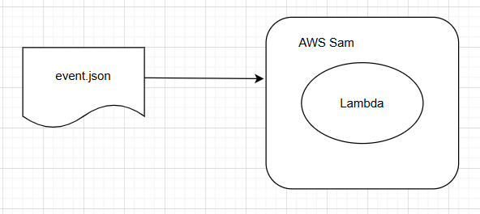

Suppose we want to send an email. We can use following code example to send a SNS message from Ruby:

```
gem 'aws-sdk-sns', '~> 1'

sns = Aws::SNS::Client.new(
  region: Rails.application.credentials.dig(:aws, :region),
  access_key_id: Rails.application.credentials.dig(:aws, :access_key_id),
  secret_access_key: Rails.application.credentials.dig(:aws, :secret_access_key)
)

sns.publish({
  topic_arn: Rails.application.credentials.dig(:aws, :topic_arn),
  message: {
    recipient: 'abc@gmail.com',
    subject: 'Hello',
    body: 'This is an email'
  }.to_json,
  message_attributes: {
    action: {
      data_type: "String",
      string_value: "send_email"
    }
  }
})
```

Some of the settings are stored in env variables so each environment (staging, production...) can have its own setting.

## How to test on local

### Method 1: LocalStack

Set up SNS and SQS using LocalStack. And start Lambda in watch mode.

This method is more formal but a bit involved.

For setting SNS and SQS please refer to the LocalStack <a target="_blank" href="https://docs.localstack.cloud/user-guide/aws/sns/#working-with-sqs-subscriptions-for-sns">document</a>.


### Method 2: Invoke Lambda with test events

The second way is a bit easier to setup. All we need to do is to prepare event.json.

We already know the shape of the event:

```
message: {
  recipient: 'abc@gmail.com',
  subject: 'Hello',
  body: 'This is an email'
}.to_json,
```
and the action of the event (send_email)

All we need to do is to put the message in the body of events/event.json.

```
{
  "Records": [
    {
      "messageId": "1c3e3d9a-85e0-457f-bc7e-45d96b56c587",
      "receiptHandle": "MessageReceiptHandle1",
      "body": "{recipient:'abc@gmail.com',subject:'Hello',body:'This is an email'}",
      "attributes": {
        "ApproximateReceiveCount": "1",
        "SentTimestamp": "1625112000000",
        "SenderId": "AIDAEXAMPLE",
        "ApproximateFirstReceiveTimestamp": "1625112000000"
      },
      "messageAttributes": {
        "Attribute1": {
          "stringValue": "Value1",
          "dataType": "String"
        },
        "Attribute2": {
          "stringValue": "123",
          "dataType": "Number"
        }
      },
      "md5OfBody": "1d4a3a7151586b95d25fbbd2f9d57e38",
      "eventSource": "aws:sqs",
      "eventSourceARN": "arn:aws:sqs:us-east-1:123456789012:MyQueue",
      "awsRegion": "us-east-1"
    }
  ]
}
```
Other attributes like messageId, receiptHandle, attributes, messageAttributes...are not important.

Invoke Lambda with this event:
```
sam local invoke -e events/event.json --env-vars env_vars.json
```
And in Lambda we just need to focus on our business logic (sending email).

```
type Email struct {
  recipient string `json:"recipient"`
  subject   string `json:"subject"`
  body      string `json:"body"`
}

func handler(ctx context.Context, event events.SQSEvent) error {
  for _, record := range event.Records {
    fmt.Printf("Processing message ID: %s, Message body: %s\n", record.MessageId, record.Body)

    var email Email
    err := json.Unmarshal([]byte(record.Body), &email)
    if err != nil {
      fmt.Println("Error parsing JSON:", err)
      continue
    }

    send(email)
```

