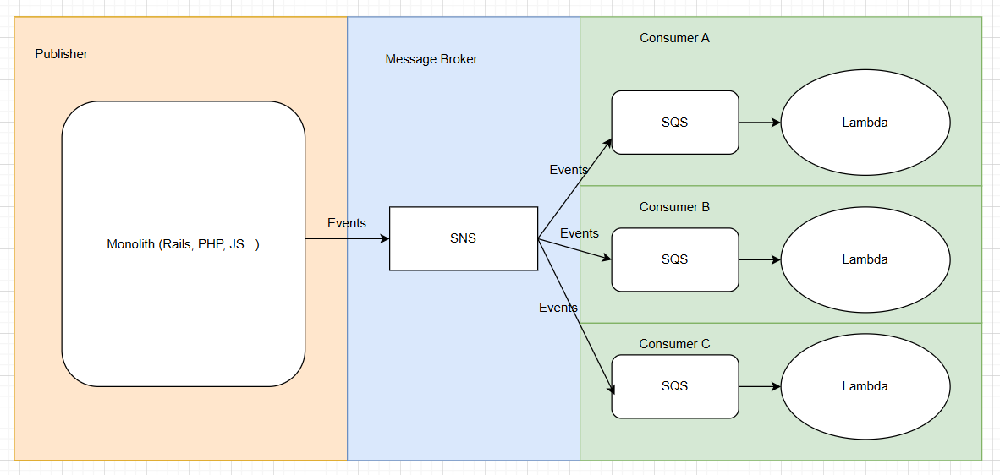

A consumer contains a SQS and a Lambda. Each consumer can be managed by a team.

1. Each team can define its own data queueing policy, failed destination, or dead letter queue.

2. Each team can define its own provisioned concurrency and preserved concurrency for Lambda.

An example of SAM template for provisioning SQS and Lambda looks like this:

``` yaml linenums="1" title="template.yaml" hl_lines="14-53 57 65 66 67 69 70 98-101 103"
AWSTemplateFormatVersion: '2010-09-09'
Transform: AWS::Serverless-2016-10-31
Description: >
  lambda-go
  
  Sample SAM Template for lambda-go

# More info about Globals: https://github.com/awslabs/serverless-application-model/blob/master/docs/globals.rst
Globals:
  Function:
    Timeout: 30
    MemorySize: 128

Parameters: # (4)
  DefaultVPCSubnetIDs:
    Type: "List<AWS::EC2::Subnet::Id>"
    Description: "List of Subnet IDs for the Lambda function to access resources within a VPC"

  EBEC2SecurityGroupIDs:
    Type: "List<AWS::EC2::SecurityGroup::Id>"
    Description: "List of Security Group IDs for the Lambda function to control network access"
  
  DBHost:
    Type: String
    Description: "Database host endpoint (e.g., RDS endpoint or IP address)"

  DBUser:
    Type: String
    Description: "Database username"
  
  DBPass:
    Type: String
    Description: "Database password"
  
  DBName:
    Type: String
    Description: "Database name"

  DBPort:
    Type: String
    Description: "Database port"

  DBSSLMode:
    Type: String
    Description: "Database SSL mode"

  SNSTopicArn:
    Type: String
    Description: ARN of the existing SNS topic

  Env:
    Type: String
    Description: Env

Resources:
  GoMicroservice1Queue:
    Type: AWS::SQS::Queue # (5)
    Properties:
      QueueName: !Sub "${Env}-email-queue"

  GoMicroservice1Subscription:
    Type: AWS::SNS::Subscription
    Properties:
      Protocol: sqs
      Endpoint: !GetAtt GoMicroservice1Queue.Arn # (3)
      TopicArn: !Ref SNSTopicArn
      RawMessageDelivery: true # (6)
      FilterPolicy:
        action: # (1)
          - 'send_email'

  QueuePolicy:
    Type: AWS::SQS::QueuePolicy
    Properties:
      Queues:
        - !Ref GoMicroservice1Queue
      PolicyDocument:
        Version: "2012-10-17"
        Statement:
          - Effect: Allow
            Principal: "*"
            Action: "SQS:SendMessage"
            Resource: !GetAtt GoMicroservice1Queue.Arn
            Condition:
              ArnEquals:
                aws:SourceArn: !Ref SNSTopicArn

  GoMicroserviceFunction:
    Type: AWS::Serverless::Function # More info about Function Resource: https://github.com/awslabs/serverless-application-model/blob/master/versions/2016-10-31.md#awsserverlessfunction
    Metadata:
      BuildMethod: go1.x
    Properties:
      CodeUri: hello-world/
      Handler: bootstrap
      Runtime: provided.al2023
      Events:
        SQSTrigger:
          Type: SQS # (2)
          Properties:
            Queue: !GetAtt GoMicroservice1Queue.Arn
            BatchSize: 10  # Number of messages to process at once
            FunctionResponseTypes:
              - ReportBatchItemFailures # (7)
      Architectures:
        - x86_64
      VpcConfig:
        SecurityGroupIds: !Ref EBEC2SecurityGroupIDs
        SubnetIds: !Ref DefaultVPCSubnetIDs
      Environment:
        Variables:
          DB_HOST: !Ref DBHost       # Use the parameter here
          DB_USER: !Ref DBUser
          DB_PASS: !Ref DBPass
          DB_NAME: !Ref DBName
          DB_PORT: !Ref DBPort
          DB_SSL_MODE: !Ref DBSSLMode
          ENV: !Ref Env

Outputs:
  # ServerlessRestApi is an implicit API created out of Events key under Serverless::Function
  # Find out more about other implicit resources you can reference within SAM
  # https://github.com/awslabs/serverless-application-model/blob/master/docs/internals/generated_resources.rst#api
  GoMicroserviceFunction:
    Description: "First Lambda Function ARN"
    Value: !GetAtt GoMicroserviceFunction.Arn
  GoMicroserviceFunctionIamRole:
    Description: "Implicit IAM Role created for Hello World function"
    Value: !GetAtt GoMicroserviceFunctionRole.Arn
```

1. SNS will pass events with `send_email` to this Queue. When there are multiple consumers, each consumer can decide which event they want to receive.

2. SQS will pass events to Lambda for processing. A batch consists of 10 events.

3. Subscribe the Queue to SNS

4. Pass environment variables to Lambda.

5. Define a SQS queue

6. Enable raw message delivery. `Message` will get delivered by SNS:
```
message: {
  recipient: 'abc@gmail.com',
  subject: 'Hello',
  body: 'This is an email'
}.to_json
```
For Amazon SQS subscriptions with Raw Message Delivery enabled, a maximum of 10 message attributes can be sent.
So the following attributes will be sent by SNS as well:
```
message_attributes: {
  action: {
    data_type: "String",
    string_value: "send_email"
  }
}
```
[Source](https://docs.aws.amazon.com/sns/latest/dg/sns-large-payload-raw-message-delivery.html#message-atttributes-raw-message-delivery-sqs)

7. Lambda will only return failed items to SQS. It doesn't need to reprocess the whole batch again. See below "Things we can improve" for more information.

Here's an example of Lambda:

``` go linenums="1" title="main.go"
type Email struct {
  recipient string `json:"recipient"`
  subject   string `json:"subject"`
  body      string `json:"body"`
}

func handler(ctx context.Context, event events.SQSEvent) error {
  for _, record := range event.Records {
    fmt.Printf("Processing message ID: %s, Message body: %s\n", record.MessageId, record.Body)

    var email Email
    err := json.Unmarshal([]byte(record.Body), &email)
    if err != nil {
      fmt.Println("Error parsing JSON:", err)
      continue
    }

    send(email)
```

## Things we can improve
### SAM Connector

[SAM Connector](https://aws.amazon.com/about-aws/whats-new/2022/10/aws-sam-serverless-connectors/) simplifies the connections between source and destination resources in SAM template. You don't need to be an expert in
IAM policies to connect resources.

For example, to connect Lambda to DynamoDB:

``` yaml linenums="1" title="template.yml" hl_lines="12-14"
AWSTemplateFormatVersion: '2010-09-09'
Transform: AWS::Serverless-2016-10-31
...
Resources:
  MyFunction:
    Type: AWS::Lambda::Function
    Connectors:
      MyConn:
        Properties:
          Destination:
            Id: MyTable
          Permissions: # (1)
            - Read
            - Write
  MyTable:
    Type: AWS::DynamoDB::Table
```

1. Only needs three lines to define read and write permissions

SAM Connector [supports](https://docs.aws.amazon.com/serverless-application-model/latest/developerguide/reference-sam-connector.html) a wide range of resources. Try yourself to see if you can simplify the SAM template above (SNS to SQS, SQS to Lambda).

### Handling partial batch failures in Lambda

With this feature, when messages on an SQS queue fail to process, Lambda marks a batch of records in a message queue as partially successful and allows reprocessing of only the failed records. By processing information at a record-level instead of batch-level, AWS Lambda has removed the need of repetitive data transfer, increasing throughput and making Amazon SQS message queue processing more efficient.

[Here are examples](https://serverlessland.com/snippets/lambda-function-sqs-report-batch-item-failures) of Lambda returning failed items in different languages.