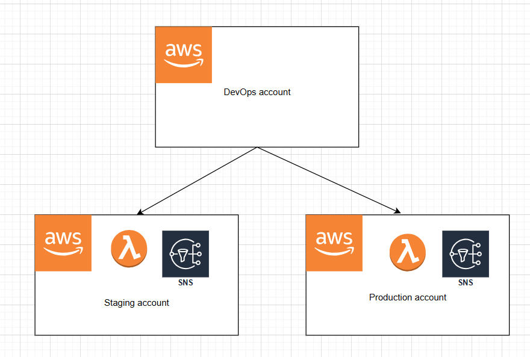

We will be using Terraform to provision SNS in staging and production environments.

There are different ways of using Terraform, depending on your AWS setup:

# Single AWS account deployment

If all your environments (staging, production...) are in one account, then when you provision resources, you have to avoid naming conflict. For example:

Production:
```
arn:aws:sns:us-east-1:123456789012:MyTopic-Prod
```

Staging:
```
arn:aws:sns:us-east-1:123456789012:MyTopic-Staging
```

Here's an example of provisioning SNS:

``` tf linenums="1" title="production/main.tf"
terraform {
  backend "s3" {
    bucket         = "dep-terraform-state"
    key            = "production/terraform.tfstate"
    region         = "ap-southeast-2"
    dynamodb_table = "terraform-state-locking"
    encrypt        = true
  }

  required_providers {
    aws = {
      source  = "hashicorp/aws"
      version = "~> 5.75.1"
    }
  }
}

module "ap-prod" {
  source = "../modules/resources" # (1)

  aws_region = "ap-southeast-2" # (2)
  env        = "prod" # (3)
}

module "na-prod" {
  source = "../modules/resources"

  aws_region = "us-east-1"
  env        = "prod"
}

module "eu-prod" {
  source = "../modules/resources"

  aws_region = "eu-west-2"
  env        = "prod"
}
```

1. Resources are defined in modules to enhance reusability
2. Passing variables to modules
3. Passing variables to modules

``` tf linenums="1" title="staging/main.tf"
terraform {
  backend "s3" {
    bucket         = "dep-terraform-state"
    key            = "staging/terraform.tfstate"
    region         = "ap-southeast-2"
    dynamodb_table = "terraform-state-locking"
    encrypt        = true
  }

  required_providers {
    aws = {
      source  = "hashicorp/aws"
      version = "~> 5.75.1"
    }
  }
}

module "ap-staging" {
  source = "../modules/resources"

  aws_region = "ap-southeast-2"
  env        = "staging"
}
```

``` tf linenums="1" title="modules/resources/main.tf"
provider "aws" {
  region = var.aws_region
}

resource "aws_sns_topic" "dep_sns" {
  name     = "dep-${var.aws_region}-${var.env}" # (1)

  tags = {
    Region      = var.aws_region
    Environment = var.env
  }
}
```

1. Use the combination of region and environment to avoid naming conflict

``` tf linenums="1" title="modules/resources/outputs.tf"
output "sns_arn" {
  value = aws_sns_topic.dep_sns.arn # (1)
}
```

1. Output SNS arn so it can be reused by other scripts (it is not being used in our example)

``` tf linenums="1" title="modules/resources/variables.tf"
variable "aws_region" {
  description = "AWS Region"
  type        = string
  default     = "ap-southeast-2"
}

variable "env" {
  description = "Environment"
  type        = string
  default     = "staging"
}
```

# Multi-AWS accounts deployment

If your environments are in multiple AWS accounts (for example, staging is in account A, production is in account B), then in general you don't have
to worry about naming conflict.

A common design pattern is:

1. A Devops account responsible for deployments in each account
2. An IAM role in each account, for which can be assumed by Devops account to deploy resources. The IAM role has to have a trust relationship with the Devops account.



Trust relationship would look like below:

``` title="IAM role in staging and production account"
{
    "Version": "2012-10-17",
    "Statement": [
        {
            "Effect": "Allow",
            "Principal": {
                "AWS": "arn:aws:iam::{DevOpsAccountID}:root"
            },
            "Action": [
                "sts:AssumeRole",
                "sts:TagSession"
            ],
            "Condition": {}
        }
    ]
}
```

A deployment script would look like below:

``` title=".github/workflows/production.yml"
name: Prod Deployment

on:
  push:
    branches:
      - main

jobs:
  deploy:
    runs-on: ubuntu-latest
    environment: prod
    steps:
      - name: Assume Role
        run: |
          export AWS_ACCESS_KEY_ID="${{ secrets.DEVOPS_ACCOUNT_ACCESS_KEY_ID }}"
          export AWS_SECRET_ACCESS_KEY="${{ secrets.DEVOPS_ACCOUNT_SECRET_ACCESS_KEY }}"
          export AWS_REGION="${{ vars.AWS_REGION }}"
          export AWS_ROLE_TO_ASSUME="${{ secrets.ROLE_TO_ASSUME_ARN }}"

          CREDENTIAL=$(aws sts assume-role \
            --duration-seconds 900 \
            --role-arn $AWS_ROLE_TO_ASSUME \
            --role-session-name SAMSession \
            --output text \
            --query 'Credentials.[AccessKeyId,SecretAccessKey,SessionToken,Expiration]')
          
          export AWS_ACCESS_KEY_ID=$(echo $CREDENTIAL | awk '{print $1}')
          export AWS_SECRET_ACCESS_KEY=$(echo $CREDENTIAL | awk '{print $2}')
          export AWS_SESSION_TOKEN=$(echo $CREDENTIAL | awk '{print $3}')
          export SESSION_EXPIRATION=$(echo $CREDENTIAL | awk '{print $4}')

      - name: Checkout
        uses: actions/checkout@v3

      - name: SAM Install
        uses: aws-actions/setup-sam@v2
        with:
          use-installer: true

      - name: SAM Validate
        run: |
          sam validate

      - name: SAM Build
        run: |
          sam build --use-container

      - name: SAM Deploy
        run: |
          sam deploy --no-confirm-changeset --no-fail-on-empty-changeset --parameter-overrides WeatherDataApiKey="${{ secrets.WEATHER_DATA_API_KEY }}"
```